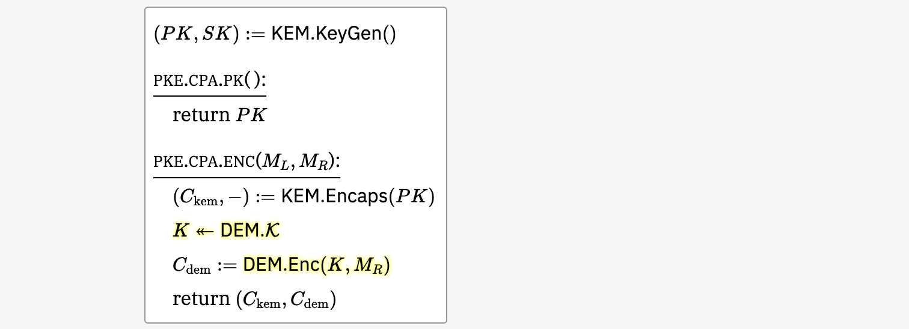

# Security of the KEM-DEM Paradigm in ProofFrog

To state a cryptographic proof in the game-hopping framework, there are several phases:

- State the syntax / interfaces of all primitives used in the construction
- State the security definitions for all primitives used in the proof
- Specify the details of the scheme you want to prove
- Give a game-hopping proof

Each security definition will be comprised of two games that are meant to be indistinguishable from the adversary's perspective.

A game-hopping proof consists of a sequence of games which are shown to be mathematically equivalent or indistinguishable under an appropriate assumption. 

For the KEM-DEM construction, we will use the following primitives and security properties:

| **Primitive**               | **Security Property**                                           |
|-----------------------------|-----------------------------------------------------------------|
| Symmetric encryption        | Computational one-time secrecy (OTS)                           |
| Key encapsulation mechanism | Indistinguishability against chosen-plaintext attacks (IND-CPA) |
| Public key encryption       | Indistinguishability against chosen-plaintext attacks (IND-CPA) |

## 1. Symmetric-key encryption

### 1.a) Syntax

Here is how Rosulek in a [Joy of Cryptography-style tutorial](https://garbledcircus.com/kemdem/left-right) defines the syntax of a symmetric-key encryption scheme:


Here is the corresponding definition in ProofFrog:

```
Primitive SymEnc(Set MessageSpace, Set CiphertextSpace, Set KeySpace) {
    Set Message = MessageSpace;
    Set Ciphertext = CiphertextSpace;
    Set Key = KeySpace;

    Ciphertext Enc(Key k, Message m);
    Message Dec(Key k, Ciphertext c);
}
```

The definition is parameterized by three sets (`MessageSpace`, `CiphertextSpace`, `KeySpace`).

### 1.b) Security definition

Here is Rosulek's Joy of Cryptography-style definition of one-time secrecy:


Here is the corresponding definition in ProofFrog. The only difference is syntactic: every variable is typed.

```
Game Left(SymEnc E) {
    E.Ciphertext ENC(E.Message mL, E.Message mR) {
        E.Key k <- E.Key;
        E.Ciphertext c = E.Enc(k, mL);
        return c;
    }
}

Game Right(SymEnc E) {
    E.Ciphertext ENC(E.Message mL, E.Message mR) {
        E.Key k <- E.Key;
        E.Ciphertext c = E.Enc(k, mR);
        return c;
    }
}

export as OTS;
```

## 2. Key encapsulation mechanism

### 2.a) Syntax

Here is Rosulek's Joy of Cryptography-style definition of the syntax of a KEM:


Here is the corresponding definition in ProofFrog:

```
Primitive KEM(Set SharedSecretSpace, Set CiphertextSpace, Set PKeySpace, Set SKeySpace) {
    Set SharedSecret = SharedSecretSpace;
    Set Ciphertext = CiphertextSpace;
    Set PublicKey = PKeySpace;
    Set SecretKey = SKeySpace;

    PublicKey * SecretKey KeyGen();
    Ciphertext * SharedSecret Encaps(PublicKey pk);
    SharedSecret Decaps(SecretKey sk, Ciphertext m);
}
```

Notice that the ProofFrog definition has one simplification: Decaps does not have the possibility of returning an error. It is possible to model this in ProofFrog, but we have omitted that case for simplicity in this tutorial.

### 2.b) Security definition

Here is Rosulek's Joy of Cryptography-style definition of IND-CPA security for KEMs:


Here is the corresponding definition in ProofFrog:

```
Game Real(KEM K) {
    K.PublicKey pk;
    K.SecretKey sk;

    Void Initialize() {
        K.PublicKey * K.SecretKey k = K.KeyGen();
        pk = k[0];
        sk = k[1];
    }

    K.PublicKey PK() {
        return pk;
    }

    K.SharedSecret * K.Ciphertext ENC() {
        K.Ciphertext * K.SharedSecret rsp = K.Encaps(pk);
        return rsp;
    }
}

Game Ideal(KEM K) {
    K.PublicKey pk;
    K.SecretKey sk;

    Void Initialize() {
        K.PublicKey * K.SecretKey k = K.KeyGen();
        pk = k[0];
        sk = k[1];
    }

    K.PublicKey PK() {
        return pk;
    }

    K.SharedSecret * K.Ciphertext ENC() {
        K.Ciphertext * K.SharedSecret rsp = K.Encaps(pk);
        K.Ciphertext ctxt = rsp[0];
        K.SharedSecret ss <- K.SharedSecret;
        return [ctxt, ss];
    }
}

export as CPAKEM;
```

Notice that ProofFrog's games have two "object-level" variables `pk` and `sk` which are available to all oracles. ProofFrog also explicitly names the "initialization" at the start of the game.

## 3. Public key encryption

### 3.a) Syntax

Here is Rosulek's Joy of Cryptography-style definition of the syntax of a public key encryption scheme:


Here is the corresponding definition in ProofFrog:

```
Primitive PubKeyEnc(Set MessageSpace, Set CiphertextSpace, Set PKeySpace, Set SKeySpace) {
    Set Message = MessageSpace;
    Set Ciphertext = CiphertextSpace;
    Set PublicKey = PKeySpace;
    Set SecretKey = SKeySpace;

    PublicKey * SecretKey KeyGen();
    Ciphertext Enc(PublicKey pk, Message m);
    Message Dec(SecretKey sk, Ciphertext m);
}
```

Again the ProofFrog definition simplifies for this tutorial by omitting the possibility of error.

### 3.b) Security definition

Here is Rosulek's Joy of Cryptography-style definition of IND-CPA security for PKEs:


Here is the corresponding definition in ProofFrog:

```
Game Left(PubKeyEnc E) {
    E.PublicKey pk;
    E.SecretKey sk;

    Void Initialize() {
        E.PublicKey * E.SecretKey k = E.KeyGen();
        pk = k[0];
        sk = k[1];
    }

    E.PublicKey PK() {
        return pk;
    }

    E.Ciphertext ENC(E.Message mL, E.Message mR) {
        return E.Enc(pk, mL);
    }
}

Game Right(PubKeyEnc E) {
    E.PublicKey pk;
    E.SecretKey sk;

    Void Initialize() {
        E.PublicKey * E.SecretKey k = E.KeyGen();
        pk = k[0];
        sk = k[1];
    }

    E.PublicKey PK() {
        return pk;
    }

    E.Ciphertext ENC(E.Message mL, E.Message mR) {
        return E.Enc(pk, mR);
    }
}

export as CPA;
```

## 4. Hybrid encryption scheme

Here is Rosulek's Joy of Cryptography-style specification of the KEM-DEM hybrid public-key encryption scheme:


Here is the corresponding definition in ProofFrog:

```
Scheme Hyb(KEM K, SymEnc E) extends PubKeyEnc {
    requires K.SharedSecret subsets E.Key;

    Set PublicKey = K.PublicKey;
    Set SecretKey = K.SecretKey;
    Set Message = E.Message;
    Set Ciphertext = K.Ciphertext * E.Ciphertext;

    PublicKey * SecretKey KeyGen() {
        return K.KeyGen();
    }

    Ciphertext Enc(PublicKey pk, Message m) {
        K.Ciphertext * K.SharedSecret x = K.Encaps(pk);
        K.Ciphertext c_kem = x[0];
        E.Key k_dem = x[1];
        E.Ciphertext c_dem = E.Enc(k_dem, m);
        return [c_kem, c_dem];
    }

    Message Dec(SecretKey sk, Ciphertext c) {
        K.Ciphertext c_kem = c[0];
        E.Ciphertext c_dem = c[1];
        K.SharedSecret k_dem = K.Decaps(sk, c_kem);
        return E.Dec(k_dem, c_dem);
    }
}
```

## 5. Proof

### Main idea of the proof

We need to show that the adversary cannot distinguish whether the public key encryption scheme is encrypting the left message or the right message in the PKE CPA security game.

We would like to show this by relying on the one-time secrecy of the symmetric encryption scheme — that no adversary can distinguish whether the symmetric encryption scheme is encrypting the left message or the right message in the DEM's OTS security game.  However we need to ensure that the DEM is using a truly random key, not the KEM shared secret, so we first have to do a hop that replaces the KEM shared secret with random.

Here is the sequence of games at a high level:

- Game 0 (starting game) Encrypt left message under real key
- Game 1: Use random KEM shared secret instead of real
- Game 2: Encrypt right message instead of left (under random key)
- Game 3: Use real KEM shared secret instead of random
Ending game: Encrypt right message under real key

### Setting up the theorem statement in ProofFrog

First we need list the primitives involved in the theorem and proof.  

This involves stating all of the sets used by all of the primitives, then giving the generic symmetric encryption and KEM schemes, and then stating the hybrid PKE from those schemes.

```
let:
    Set SymMessageSpace;
    Set KEMSharedSecretSpace;
    Set SymCiphertextSpace;
    Set KEMCiphertextSpace;

    Set PubKeySpace;
    Set SecretKeySpace;

    SymEnc E = SymEnc(SymMessageSpace, SymCiphertextSpace, KEMSharedSecretSpace);
    KEM K = KEM(KEMSharedSecretSpace, KEMCiphertextSpace, PubKeySpace, SecretKeySpace);
    Hyb H = Hyb(K, E);
```

Notice that the symmetric encryption scheme's key space is equal to the KEM shared secret space (both are `KEMSharedSecretSpace`).

Next we state the assumptions of the theorem, namely the security assumptions on the underlying primitives:

```
assume:
    OTS(E);
    CPAKEM(K);
```

We can now state the goal:

```
theorem:
    CPA(H);
```

### The sequence of games

Here is the sequence of games connected more precisely with the security experiments, plus the reductions that will be used at each game hop:

- Game 0: KEM-DEM scheme in PKE CPA-left game
- Game 1: Use random KEM shared secret instead of real
  - Reduction R1 against KEM CPA security game
      - R1 with KEM-CPA-real = Game 0
      - R1 with KEM-CPA-ideal = Game 1
- Game 2: Encrypt right message instead of left (under random key)
  - Reduction R2 against DEM OTS security game
      - R2 with DEM-OTS-left = Game 1
      - R2 with DEM-OTS-right = Game 2
- Game 3: Use real KEM shared secret instead of random
  - Reduction R3 against KEM CPA security game
      - R3 with KEM-CPA-ideal = Game 2
      - R3 with KEM-CPA-real = Game 3
- Game 3 = KEM-DEM scheme in PKE-CPA-right game

ProofFrog's proof file lists the sequence of games.  

```
games:
    // Game 0
    CPA(H).Left against CPA(H).Adversary;
    Game0(K, E, H) against CPA(H).Adversary;
    CPAKEM(K).Real compose R1(E, K, H) against CPA(H).Adversary;
    // Game 1
    CPAKEM(K).Ideal compose R1(E, K, H) against CPA(H).Adversary;
    Game1(K, E, H) against CPA(H).Adversary;
    OTS(E).Left compose R2(E, K, H) against CPA(H).Adversary;
    // Game 2
    OTS(E).Right compose R2(E, K, H) against CPA(H).Adversary;
    Game2(K, E, H) against CPA(H).Adversary;
    CPAKEM(K).Ideal compose R3(E, K, H) against CPA(H).Adversary;
    // Game 3
    CPAKEM(K).Real compose R3(E, K, H) against CPA(H).Adversary;
    Game3(K, E, H) against CPA(H).Adversary;
    CPA(H).Right against CPA(H).Adversary;
```

ProofFrog does not actually require you to write out the intermediate games (e.g., Game 1), since it can infer each intermediate game based on what the reductions resolve to.  

In other words, the following would also suffice:

```
games:
    // Game 0
    CPA(H).Left against CPA(H).Adversary;
    CPAKEM(K).Real compose R1(E, K, H) against CPA(H).Adversary;
    // Game 1
    CPAKEM(K).Ideal compose R1(E, K, H) against CPA(H).Adversary;
    OTS(E).Left compose R2(E, K, H) against CPA(H).Adversary;
    // Game 2
    OTS(E).Right compose R2(E, K, H) against CPA(H).Adversary;
    CPAKEM(K).Ideal compose R3(E, K, H) against CPA(H).Adversary;
    // Game 3
    CPAKEM(K).Real compose R3(E, K, H) against CPA(H).Adversary;
    CPA(H).Right against CPA(H).Adversary;
```

The remaining task as the author of the proof is to write the three reductions `R1`, `R2`, `R3` that are needed to satisfy the game hops.  We'll do that by following along with the Joy of Cryptography-style proof.

### Game 0: Inline KEM-DEM scheme into CPA-left

Here is the initial Game 0, which is the KEM-DEM scheme inlined into the PKE CPA left experiment. Notice 


In the ProofFrog game sequence, we don't have to write this out in full; it is computed automatically by the line

```
games:
    CPA(H).Left against CPA(H).Adversary;
```

If we run ProofFrog using `proof_frog prove Hyb-is-CPA.proof`, it will print out the inlined version of Game 0:

```
Game Left() {
  PubKeySpace pk;
  SecretKeySpace sk;
  Void Initialize() { 
    PubKeySpace * SecretKeySpace k = K.KeyGen();
    pk = k[0];
    sk = k[1];
  }
  PubKeySpace PK() { 
    return pk;
  }
  KEMCiphertextSpace * SymCiphertextSpace ENC(SymMessageSpace mL, SymMessageSpace mR) { 
    KEMCiphertextSpace * KEMSharedSecretSpace H.Enc@x0 = K.Encaps(pk);
    KEMCiphertextSpace H.Enc@c_kem0 = H.Enc@x0[0];
    KEMSharedSecretSpace H.Enc@k_dem0 = H.Enc@x0[1];
    SymCiphertextSpace H.Enc@c_dem0 = E.Enc(H.Enc@k_dem0, mL);
    return [H.Enc@c_kem0, H.Enc@c_dem0];
  }
}
```

Notice that it has applied namespacing to variables that come from inlining to avoid name clashes.

The ProofFrog engine will then transform this game into a canonical form by simplifying it as much as it can:

```
Game Left() {
  PubKeySpace field1;
  Void Initialize() { 
    PubKeySpace * SecretKeySpace v1 = K.KeyGen();
    field1 = v1[0];
  }
  PubKeySpace PK() { 
    return field1;
  }
  KEMCiphertextSpace * SymCiphertextSpace ENC(SymMessageSpace mL, SymMessageSpace mR) { 
    KEMCiphertextSpace * KEMSharedSecretSpace v2 = K.Encaps(field1);
    KEMCiphertextSpace v3 = v2[0];
    KEMSharedSecretSpace v4 = v2[1];
    SymCiphertextSpace v5 = E.Enc(v4, mL);
    return [v3, v5];
  }
}
```

### Game 0 is equivalent to a reduction calling into the CPA-real game for the KEM

The Joy of Cryptography-style proof observes that Game 0 is equivalent to a reduction that calls out to the oracles in a CPA-real game for the KEM:


This informs the reduction that we write in ProofFrog:

```
Reduction R1(SymEnc E, KEM K, Hyb H) compose CPAKEM(K) against CPA(H).Adversary {
    H.PublicKey PK() {
        return challenger.PK();
    }
    H.Ciphertext ENC(H.Message mL, H.Message mR) {
        K.Ciphertext * K.SharedSecret y = challenger.ENC();
        K.Ciphertext c_kem = y[0];
        K.SharedSecret k_dem = y[1];
        E.Ciphertext c_dem = E.Enc(k_dem, mL);
        return [c_kem, c_dem];
    }
}
```

Then we add this reduction to our sequence of games, which now reads:

```
games:
    CPA(H).Left against CPA(H).Adversary;
    CPAKEM(K).Real compose R1(E, K, H) against CPA(H).Adversary;
```

The ProofFrog engine will compute the result of inlining the reduction `R1` into the KEM CPA-real experiment and verify that it is code-wise equivalent to the previous game.  

Here is the simplified version of that inlining, which you'll notice is exactly equal (as a string) to the previous simplified game:

```
Game Inlined() {
  PubKeySpace field1;
  Void Initialize() { 
    PubKeySpace * SecretKeySpace v1 = K.KeyGen();
    field1 = v1[0];
  }
  PubKeySpace PK() { 
    return field1;
  }
  KEMCiphertextSpace * SymCiphertextSpace ENC(SymMessageSpace mL, SymMessageSpace mR) { 
    KEMCiphertextSpace * KEMSharedSecretSpace v2 = K.Encaps(field1);
    KEMCiphertextSpace v3 = v2[0];
    KEMSharedSecretSpace v4 = v2[1];
    SymCiphertextSpace v5 = E.Enc(v4, mL);
    return [v3, v5];
  }
}
```

### Hop to Game 1 by switching the KEM CPA-real game to CPA-ideal

The Joy of Cryptography-style proof now switches the KEM CPA-real game to the KEM CPA-ideal game, which we are allowed to under the assumption that the KEM is CPA-secure.


In ProofFrog, we add this switch as the next game in the sequence:

```
games:
    CPA(H).Left against CPA(H).Adversary;
    CPAKEM(K).Real compose R1(E, K, H) against CPA(H).Adversary;
    CPAKEM(K).Ideal compose R1(E, K, H) against CPA(H).Adversary;
```

ProofFrog will accept this step in the game hop sequence because we made the assumption `CPAKEM(K);` in the `assume` section of the proof.

### Game 1: Write out Game 1 explicitly by inlining previous figure


In the Joy of Cryptography-style proof we now note that KEM shared secret space equals symmetric key encryption space:


We don't need to do anything further for this in ProofFrog, since we the keyspace of the DEM to be the same set as the shared secret space of the KEM when we set up the schemes for the theorem statement:

```
SymEnc E = SymEnc(SymMessageSpace, SymCiphertextSpace, KEMSharedSecretSpace);
KEM K = KEM(KEMSharedSecretSpace, KEMCiphertextSpace, PubKeySpace, SecretKeySpace);
```

### Game 1 is equivalent to a reduction calling into the OTS-left game for the DEM

The Joy of Cryptography-style proof observes that Game 1 is equivalent to a reduction that calls out to the oracles in a OTS-left game for the DEM:


Here is that reduction written in ProofFrog:

```
Reduction R2(SymEnc E, KEM K, Hyb H) compose OTS(E) against CPA(H).Adversary {
    K.PublicKey pk;
    K.SecretKey sk;
    Void Initialize() {
        K.PublicKey * K.SecretKey k = K.KeyGen();
        pk = k[0];
        sk = k[1];
    }
    H.PublicKey PK() { 
        return pk;
    }

    H.Ciphertext ENC(H.Message mL, H.Message mR) {
        K.Ciphertext * K.SharedSecret x = K.Encaps(pk);
        K.Ciphertext c_kem = x[0];
        E.Ciphertext c_dem = challenger.ENC(mL, mR);
        return [c_kem, c_dem];
    }
}
```

Then we add this reduction to our sequence of games, which now reads:

```
games:
    CPA(H).Left against CPA(H).Adversary;
    CPAKEM(K).Real compose R1(E, K, H) against CPA(H).Adversary;
    CPAKEM(K).Ideal compose R1(E, K, H) against CPA(H).Adversary;
    OTS(E).Left compose R2(E, K, H) against CPA(H).Adversary;
```

ProofFrog checks that it is code-wise equivalence to the previous game.

### Hop to Game 2 by switching the DEM OTS-left game to OTS-right

The Joy of Cryptography-style proof now switches the DEM OTS-left game to the DEM OTS-right game, which we are allowed to under the assumption that the DEM is one-time secure.


In ProofFrog, we add this switch as the next game in the sequence:

```
games:
    CPA(H).Left against CPA(H).Adversary;
    CPAKEM(K).Real compose R1(E, K, H) against CPA(H).Adversary;
    CPAKEM(K).Ideal compose R1(E, K, H) against CPA(H).Adversary;
    OTS(E).Left compose R2(E, K, H) against CPA(H).Adversary;
    OTS(E).Right compose R2(E, K, H) against CPA(H).Adversary;
```

ProofFrog will accept this step in the game hop sequence because we made the assumption `OTS(E);` in the `assume` section of the proof.

### Game 2: Write out Game 2 explicitly by inlining previous figure



In the Joy of Cryptography-style proof we again note that KEM shared secret space equals symmetric key encryption space:


We again don't need to do anything further for this in ProofFrog, since we the keyspace of the DEM to be the same set as the shared secret space of the KEM when we set up the schemes for the theorem statement.

### Game 2 is equivalent to a reduction calling into the CPA-ideal game for the KEM

The Joy of Cryptography-style proof observes that Game 2 is equivalent to a reduction that calls out to the oracles in a CPA-ideal game for the KEM:


Here is that reduction written in ProofFrog:

```
Reduction R3(SymEnc E, KEM K, Hyb H) compose CPAKEM(K) against CPA(H).Adversary {
    H.PublicKey PK() {
        return challenger.PK();
    }
    H.Ciphertext ENC(H.Message mL, H.Message mR) {
        K.Ciphertext * K.SharedSecret y = challenger.ENC();
        K.Ciphertext c_kem = y[0];
        K.SharedSecret k_dem = y[1];
        E.Ciphertext c_dem = E.Enc(k_dem, mR);
        return [c_kem, c_dem];
    }
}
```

Then we add this reduction to our sequence of games, which now reads:

```
games:
    CPA(H).Left against CPA(H).Adversary;
    CPAKEM(K).Real compose R1(E, K, H) against CPA(H).Adversary;
    CPAKEM(K).Ideal compose R1(E, K, H) against CPA(H).Adversary;
    OTS(E).Left compose R2(E, K, H) against CPA(H).Adversary;
    OTS(E).Right compose R2(E, K, H) against CPA(H).Adversary;
    CPAKEM(K).Ideal compose R3(E, K, H) against CPA(H).Adversary;
```

ProofFrog checks that it is code-wise equivalence to the previous game.

### Hop to Game 3 by switching the KEM CPA-ideal game to CPA-real

The Joy of Cryptography-style proof now switches the KEM CPA-ideal game to the KEM CPA-ideal game, which we are allowed to under the assumption that the KEM is CPA secure.


In ProofFrog, we add this switch as the next game in the sequence:

```
games:
    CPA(H).Left against CPA(H).Adversary;
    CPAKEM(K).Real compose R1(E, K, H) against CPA(H).Adversary;
    CPAKEM(K).Ideal compose R1(E, K, H) against CPA(H).Adversary;
    OTS(E).Left compose R2(E, K, H) against CPA(H).Adversary;
    OTS(E).Right compose R2(E, K, H) against CPA(H).Adversary;
    CPAKEM(K).Ideal compose R3(E, K, H) against CPA(H).Adversary;
    CPAKEM(K).Real compose R3(E, K, H) against CPA(H).Adversary;
```

ProofFrog will accept this step in the game hop sequence because we made the assumption `OTS(E);` in the `assume` section of the proof.

### Game 3: Write out Game 3 explicitly by inlining previous slide


### Game 3 is equivalent to the inlining of the KEM-DEM scheme into the PKE CPA-right game

ProofFrog checks this claim when we add it to the game sequence:

```
games:
    CPA(H).Left against CPA(H).Adversary;
    CPAKEM(K).Real compose R1(E, K, H) against CPA(H).Adversary;
    CPAKEM(K).Ideal compose R1(E, K, H) against CPA(H).Adversary;
    OTS(E).Left compose R2(E, K, H) against CPA(H).Adversary;
    OTS(E).Right compose R2(E, K, H) against CPA(H).Adversary;
    CPAKEM(K).Ideal compose R3(E, K, H) against CPA(H).Adversary;
    CPAKEM(K).Real compose R3(E, K, H) against CPA(H).Adversary;
    CPA(H).Right against CPA(H).Adversary;
```

Because our sequence of games starts with `CPA(H).Left` and ends with `CPA(H).Right`, ProofFrog is now satisfied that the goal of the theorem (`CPA(H)`) is true, and outputs:

```
Proof Succeeded!
```
