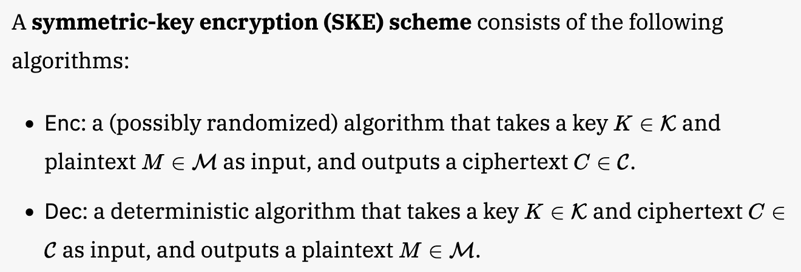

# Security of the KEM-DEM Paradigm in ProofFrog

To state a cryptographic proof in the game-hopping framework, there are several phases:

- State the syntax / interfaces of all primitives used in the construction
- State the security definitions for all primitives used in the proof
- Specify the details of the scheme you want to prove
- Give a game-hopping proof

Each security definition will be comprised of two games that are meant to be indistinguishable from the adversary's perspective.

A game-hopping proof consists of a sequence of games which are shown to be mathematically equivalent or indistinguishable under an appropriate assumption. 

For the KEM-DEM construction, we will use the following primitives and security properties:

| **Primitive**               | **Security Property**                                           |
|-----------------------------|-----------------------------------------------------------------|
| Symmetric encryption        | Computational one-time secrecy (OTS)                           |
| Key encapsulation mechanism | Indistinguishability against chosen-plaintext attacks (IND-CPA) |
| Public key encryption       | Indistinguishability against chosen-plaintext attacks (IND-CPA) |

## 1. Symmetric-key encryption

### 1.a) Syntax

Here is how Joy of Cryptography defines the syntax of a symmetric-key encryption scheme:



Here is the corresponding definition in ProofFrog:

```
Primitive SymEnc(Set MessageSpace, Set CiphertextSpace, Set KeySpace) {
    Set Message = MessageSpace;
    Set Ciphertext = CiphertextSpace;
    Set Key = KeySpace;

    Ciphertext Enc(Key k, Message m);
    Message Dec(Key k, Ciphertext c);
}
```

The definition is parameterized by three sets (`MessageSpace`, `CiphertextSpace`, `KeySpace`).

### 1.b) Security definition

Here is how Joy of Cryptography defines one-time secrecy:


Here is the corresponding definition in ProofFrog. The only difference is syntactic: every variable is typed.

```
Game Left(SymEnc E) {
    E.Ciphertext ENC(E.Message mL, E.Message mR) {
        E.Key k <- E.Key;
        E.Ciphertext c = E.Enc(k, mL);
        return c;
    }
}

Game Right(SymEnc E) {
    E.Ciphertext ENC(E.Message mL, E.Message mR) {
        E.Key k <- E.Key;
        E.Ciphertext c = E.Enc(k, mR);
        return c;
    }
}

export as OTS;
```

## 2. Key encapsulation mechanism

### 2.a) Syntax

Here is how Joy of Cryptography defines the syntax of a KEM:


Here is the corresponding definition in ProofFrog:

```
Primitive KEM(Set SharedSecretSpace, Set CiphertextSpace, Set PKeySpace, Set SKeySpace) {
    Set SharedSecret = SharedSecretSpace;
    Set Ciphertext = CiphertextSpace;
    Set PublicKey = PKeySpace;
    Set SecretKey = SKeySpace;

    PublicKey * SecretKey KeyGen();
    Ciphertext * SharedSecret Encaps(PublicKey pk);
    SharedSecret Decaps(SecretKey sk, Ciphertext m);
}
```

Notice that the ProofFrog definition has one simplification: Decaps does not have the possibility of returning an error. It is possible to model this in ProofFrog, but we have omitted that case for simplicity in this tutorial.

### 2.b) Security definition

Here is how Joy of Cryptography defines IND-CPA security for KEMs:


Here is the corresponding definition in ProofFrog:

```
Game Real(KEM K) {
    K.PublicKey pk;
    K.SecretKey sk;

    Void Initialize() {
        K.PublicKey * K.SecretKey k = K.KeyGen();
        pk = k[0];
        sk = k[1];
    }

    K.PublicKey PK() {
        return pk;
    }

    K.SharedSecret * K.Ciphertext ENC() {
        K.Ciphertext * K.SharedSecret rsp = K.Encaps(pk);
        return rsp;
    }
}

Game Random(KEM K) {
    K.PublicKey pk;
    K.SecretKey sk;

    Void Initialize() {
        K.PublicKey * K.SecretKey k = K.KeyGen();
        pk = k[0];
        sk = k[1];
    }

    K.PublicKey PK() {
        return pk;
    }

    K.SharedSecret * K.Ciphertext ENC() {
        K.Ciphertext * K.SharedSecret rsp = K.Encaps(pk);
        K.Ciphertext ctxt = rsp[0];
        K.SharedSecret ss <- K.SharedSecret;
        return [ctxt, ss];
    }
}

export as CPAKEM;
```

Notice that ProofFrog's games have two "object-level" variables `pk` and `sk` which are available to all oracles. ProofFrog also explicitly names the "initialization" at the start of the game.

## 3. Public key encryption

### 3.a) Syntax

Here is how Joy of Cryptography defines the syntax of a public key encryption scheme:


Here is the corresponding definition in ProofFrog:

```
Primitive PubKeyEnc(Set MessageSpace, Set CiphertextSpace, Set PKeySpace, Set SKeySpace) {
    Set Message = MessageSpace;
    Set Ciphertext = CiphertextSpace;
    Set PublicKey = PKeySpace;
    Set SecretKey = SKeySpace;

    PublicKey * SecretKey KeyGen();
    Ciphertext Enc(PublicKey pk, Message m);
    Message Dec(SecretKey sk, Ciphertext m);
}
```

Again the ProofFrog definition simplifies for this tutorial by omitting the possibility of error.

### 3.b) Security definition

Here is how Joy of Cryptography defines IND-CPA security for PKEs:


Here is the corresponding definition in ProofFrog:

```
Game Left(PubKeyEnc E) {
    E.PublicKey pk;
    E.SecretKey sk;

    Void Initialize() {
        E.PublicKey * E.SecretKey k = E.KeyGen();
        pk = k[0];
        sk = k[1];
    }

    E.PublicKey PK() {
        return pk;
    }

    E.Ciphertext ENC(E.Message mL, E.Message mR) {
        return E.Enc(pk, mL);
    }
}

Game Right(PubKeyEnc E) {
    E.PublicKey pk;
    E.SecretKey sk;

    Void Initialize() {
        E.PublicKey * E.SecretKey k = E.KeyGen();
        pk = k[0];
        sk = k[1];
    }

    E.PublicKey PK() {
        return pk;
    }

    E.Ciphertext ENC(E.Message mL, E.Message mR) {
        return E.Enc(pk, mR);
    }
}

export as CPA;
```

## 4. Hybrid encryption scheme

Here is how Joy of Cryptography specifies the KEM-DEM hybrid public-key encryption scheme:


Here is the corresponding definition in ProofFrog:

```
Scheme Hyb(KEM K, SymEnc E) extends PubKeyEnc {
    requires K.SharedSecret subsets E.Key;

    Set PublicKey = K.PublicKey;
    Set SecretKey = K.SecretKey;
    Set Message = E.Message;
    Set Ciphertext = K.Ciphertext * E.Ciphertext;

    PublicKey * SecretKey KeyGen() {
        return K.KeyGen();
    }

    Ciphertext Enc(PublicKey pk, Message m) {
        K.Ciphertext * K.SharedSecret x = K.Encaps(pk);
        K.Ciphertext c_kem = x[0];
        E.Key k_dem = x[1];
        E.Ciphertext c_dem = E.Enc(k_dem, m);
        return [c_kem, c_dem];
    }

    Message Dec(SecretKey sk, Ciphertext c) {
        K.Ciphertext c_kem = c[0];
        E.Ciphertext c_dem = c[1];
        K.SharedSecret k_dem = K.Decaps(sk, c_kem);
        return E.Dec(k_dem, c_dem);
    }
}
```
